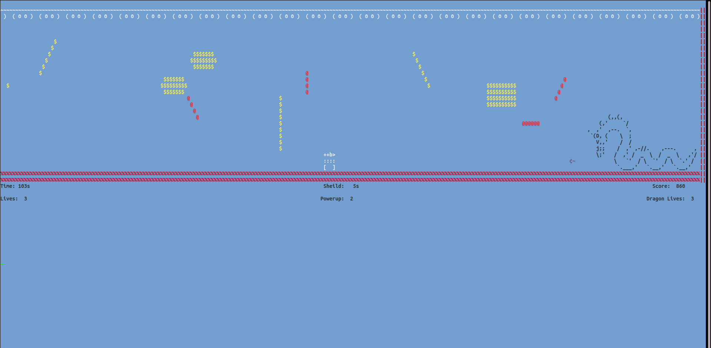
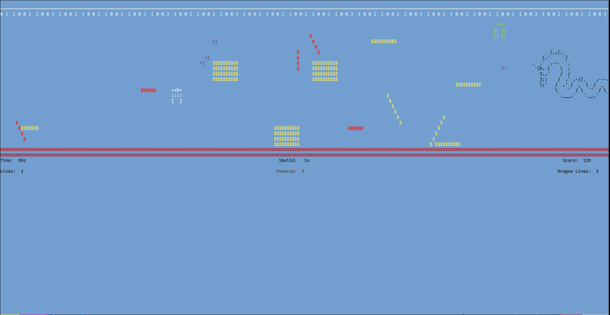
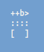
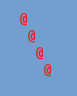
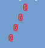
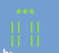
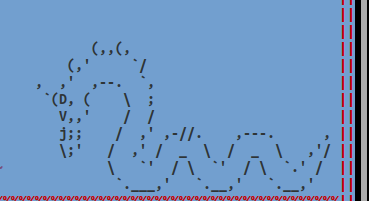

**Table of Contents**
- [Jety_Joy](#jety_joy)
  - [Gameplay](#gameplay)
  - [Main Features:](#main-features)
  - [Rules](#rules)
  - [Controls:](#controls)

# Jety_Joy

Jety_Joy is a game made in Python3. It is similar to but a simpler version of Jetpack Joyride by Halfbrick Studios. 

## Gameplay

The objective is to go through the course avoiding a bunch of firebeams and collecting coins and finally kill the boss enemy to kill the game.

The entities encountered in the game are:

- ## Main character
    Jety (No Sheild)

  
  Jety (Sheild)

- ## Firebeams
  
  
  
  

- ## Magnet
  

- ## Coins
  
  
  
  
  
  

- ## Dragon
  

- ## Powerup
  
  
## Main Features:

- Whole game is made using ASCII characters
- The playable area changes according to the size of the terminal
- Constantly moving screen 
- Gravity effect shown by the main player and bullets
- Parabolic path of bullets
- Sheild to protect the player
- Magnets that exert a constant force of attraction on the player
- Constantly moving background
- Boss Enemy
- Color  

## Rules

1. The player will have 3 lives
2. The player will have a total of 1200s to complete the game
3. The dragon will have 3 lives
4. The shield can be activated for 10s with a cooldown period of 60s
5. Powerup will speed up the game for 10s
6. Hitting a firebeam will cost a life
7. Hitting an iceball will cost a life
8. Collecting one coin increments score by 20
9. Destroying one firebeam increments score by 10
10. Destroying one magnet increments score by 15
11. Killing the dragon increments the score by 100

## Controls

- 'w': Go Up
- 'a': Go left
- 'd': Go right
- 'space': Activate Sheild
- 'b': Fire blaster
- 'q': Quit

## How to run

- (If not installed) Install colorama `pip3 install colorama`
- Run the game by `python3 run.py`
